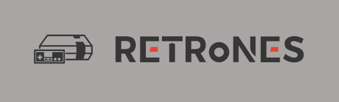

RETRoNES
=============

 

A basic NES emulator written in C++ for learning purposes.

NOTE: The current version of the emulator does not include sound and only supports player one. These features are to be added later.

## Compiling

Required:
* C++17 compliant compiler

## Controller

To end emulation, press ESC.

 Button        | Mapped to
 --------------|-------------
 Start         | Enter
 Select        | Shift
 A             | X
 B             | Z
 Up            | ↑
 Down          | ↓
 Left          | ←
 Right         | →