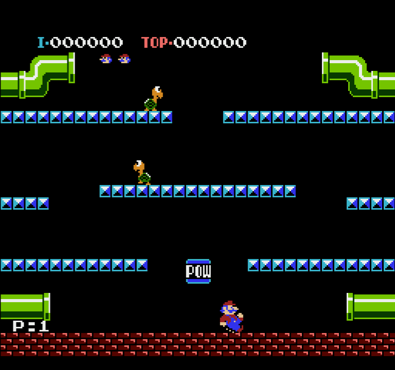
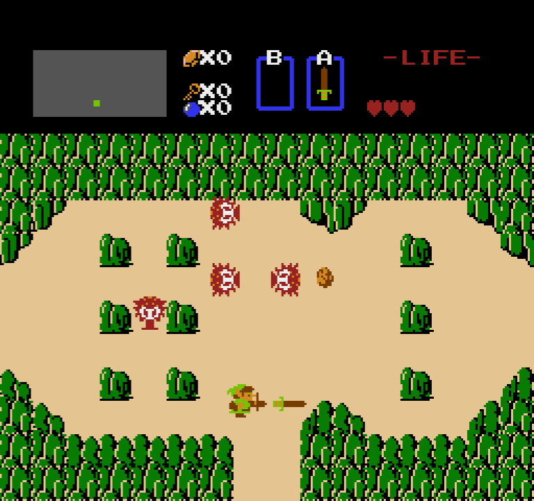

RETRoNES
=============

<br />

A basic NES emulator written in C++ for learning purposes.

NOTE: The current version of the emulator does not include sound and only supports player one.

The emulator makes use of OneLoneCoder's OLC Pixel Game Engine: https://github.com/OneLoneCoder/olcPixelGameEngine

Games that have been tested to run:

* Mario Bros
* Super Mario Bros
* Donkey Kong
* Legend of Zelda
* Kirby's Adventure
* Metroid
* Kid Icarus
* Excitebike
* Ice Climbers
* Castlevania
* Mega Man
* Ninja Gaiden

## Installation

You'll need:
* C++17 compliant compiler (MinGW64 on Windows / g++ on Ubuntu)
* CMake

### Windows 10:

```
git clone https://github.com/jmrossi98/nes_emulator
cd nes_emulator
mkdir build && cd build
cmake -G "MinGW Makefiles" ..
make -j%NUMBER_OF_PROCESSORS%
```

### Ubuntu 20.04:
```
$ sudo apt update
$ sudo apt install build-essential libgl-dev libx11-dev libxi-dev libglu1-mesa-dev libpng-dev libasound2-dev
$ git clone https://github.com/jmrossi98/nes_emulator
$ cd nes_emulator
$ mkdir build/ && cd build/
$ cmake ..
$ make -j$(nproc)
```

## Running

Specify the ROM path

```
$ ./RETRoNES ~/Games/Super Mario Bros.nes
```

## Controller

To end emulation, press ESC.

 Button        | Mapped to
 --------------|-------------
 Start         | Enter
 Select        | Shift
 A             | X
 B             | Z
 Up            | ↑
 Down          | ↓
 Left          | ←
 Right         | →

## Screenshots







